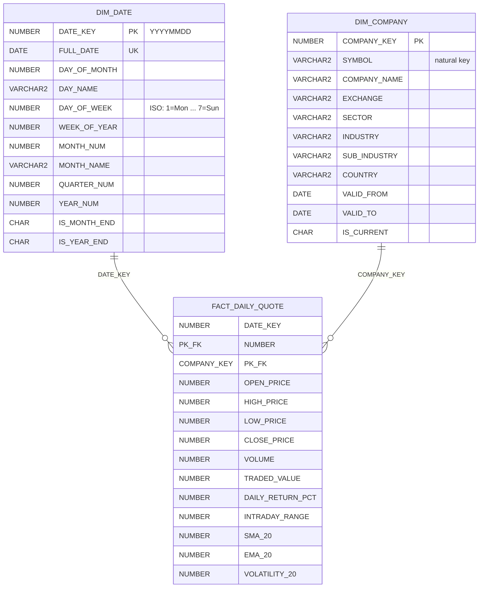
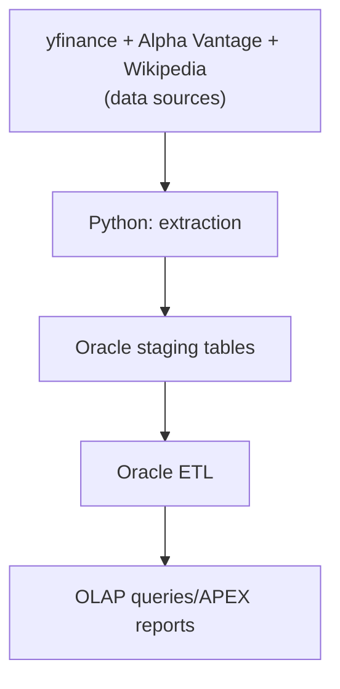

# Stock Market Data Warehouse

A data warehouse for analysing daily stock-market data. The project collects
historical OHLCV prices, company information, and S&P 500 classifications,
loads them into an Oracle staging area, and transforms them into a star schema
for analytical queries.

The warehouse includes daily returns, trading value, 20-day
simple and exponential moving averages, and 20-day volatility. Its analytical
SQL demonstrates window functions, recursive CTEs, `MATCH_RECOGNIZE`,
`ROLLUP`, and `CUBE`.

## Star schema

The warehouse uses a star schema centred on `FACT_DAILY_QUOTE`. Its grain is
**one row per company per trading day**. The fact table is identified by the
combination of `DATE_KEY` and `COMPANY_KEY`, and links to the date and company
dimensions.



`DIM_DATE` supports the hierarchies **Year → Quarter → Month → Day** and
**Year → Week → Day**. `DIM_COMPANY` supports **Sector → Industry →
Sub-industry → Company** and retains historical attribute changes through Type
2 slowly changing dimension columns (`VALID_FROM`, `VALID_TO`, and
`IS_CURRENT`).

`FACT_DAILY_QUOTE` stores OHLCV market data plus derived measures:
`TRADED_VALUE`, `DAILY_RETURN_PCT`, `INTRADAY_RANGE`, 20-day simple and
exponential moving averages (`SMA_20`, `EMA_20`), and 20-day volatility
(`VOLATILITY_20`).

## How it works



1. The Python extractor downloads price history from yfinance, company
   metadata from Alpha Vantage, and S&P 500 classifications from Wikipedia.
   Downloaded source data is cached in `raw/` so later executions only request
   newer price data when possible.
2. It writes Oracle-ready CSVs to `output/`:
   `stg_daily_prices.csv`, `stg_company_overview.csv`, and
   `stg_sp500_components.csv`.
3. The Python Oracle loader replaces the contents of the corresponding staging
   tables with those CSVs.
4. Oracle SQL populates `DIM_DATE`, maintains `DIM_COMPANY` as a Type 2 slowly
   changing dimension, and incrementally merges data into
   `FACT_DAILY_QUOTE`.
5. The OLAP and APEX query files analyse the populated star schema.

## Project layout

```text
src/stock_market_dw/
  ingestion/extract_to_staging.py  Download sources and create staging CSVs
  pipeline/load_to_oracle.py       Load generated CSVs into Oracle
sql/
  staging/                         Staging-table DDL
  schema/                          Star-schema DDL
  etl/                             Stage-to-warehouse ETL
  olap/                            Analytical and APEX query examples
raw/                               Local source-data cache (generated)
output/                            Oracle-ready CSVs (generated)
```

## Prerequisites

- Python 3.9 or later
- An [Alpha Vantage API key](https://www.alphavantage.co/support/#api-key)
- Internet access for the data sources
- An Oracle database only if you want to load and query the warehouse. The
  loader is designed for Oracle Autonomous Database using an Oracle Wallet.

## Run locally

From the repository root, create and activate a virtual environment, then
install the project:

```bash
python3 -m venv .venv
source .venv/bin/activate
python -m pip install --upgrade pip
python -m pip install -e .
```

Create a `.env` file in the repository root and add your Alpha Vantage key:

```dotenv
ALPHAVANTAGE_KEY=your_alpha_vantage_key
```

Generate the staging CSV files:

```bash
python -m stock_market_dw.ingestion.extract_to_staging
```

The first run downloads the complete available price history for the configured
symbols. Alpha Vantage's free tier is rate-limited, so company-overview requests
are deliberately paced and the first run may take several minutes. Subsequent
runs reuse the local cache in `raw/` and fetch only missing price dates.

## Load the CSVs into Oracle (optional)

Before loading, create the staging tables in Oracle and add these values to
`.env`:

```dotenv
ORACLE_WALLET_DIR=/absolute/path/to/Wallet_your_database.zip
ORACLE_WALLET_PASSWORD=wallet_password_if_required
ORACLE_DSN=your_database_high
ORACLE_USER=your_oracle_user
ORACLE_PASSWORD=your_oracle_password
```

`ORACLE_DSN` is optional: the loader selects a suitable alias from the wallet
when it is omitted. The wallet can be either a ZIP file or an extracted wallet
directory.

Then run:

```bash
python -m stock_market_dw.pipeline.load_to_oracle
```

The loader truncates and reloads each available `STG_*` table, so run it only
when replacing the staging data is intended. It does not run the warehouse ETL;
that transformation remains in Oracle.

## Oracle SQL

The `sql/` directory contains Oracle SQL scripts. Run these in an Oracle-aware
tool such as Oracle SQL Developer, Database Actions, APEX SQL Workshop, or
SQL*Plus—not as terminal commands in this project.

Recommended order:

1. `sql/staging/staging_ddl.sql` — create the staging tables.
2. `sql/schema/star_schema_ddl.sql` — create the dimensions and fact table.
3. Run the Python extraction and, optionally, the Oracle loader above.
4. `sql/etl/etl_stage_to_dwh.sql` — populate the star schema.
5. `sql/olap/olap_queries.sql` — explore the data.

`sql/etl-store-procedure/etl-store-procedure-scheduled.sql` is an optional
alternative to the standalone ETL script. It creates an Oracle stored procedure
and scheduler job for recurring transformations.

## Development commands

Install the development extras and run the available test suite with:

```bash
python -m pip install -e ".[dev]"
pytest
```

## Notes

- Generated data in `raw/` and `output/`, along with `.env`, is intentionally
  excluded from version control.
- The list of symbols is defined in
  `src/stock_market_dw/ingestion/extract_to_staging.py`.
- This project is for educational and analytical use; it is not investment
  advice.
